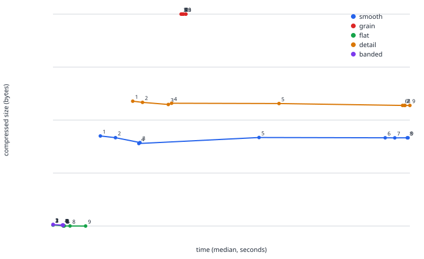

# optiff

[](https://codecov.io/github/matee911/optiff)

[](https://codecov.io/github/matee911/optiff)

Lossless recompression of layered TIFF files carrying a Photoshop block,
including the layers **inside embedded smart objects**.

On a nine-file test set: **22 GB down to 10 GB (54%)**, and with
`--zip-fallback` individual files reach **33% of the original**.

## Status

**Early development. Do not point this at files you cannot afford to lose.**

The tool is built to be safe by construction, and the next section says how.
But a design is not a promise. It has been exercised on a small set of real
files and on a generated catalogue of the cases met so far, which is not the
same as being proven against everything Photoshop can write.

So: **keep your originals**, and check the results yourself before deleting
anything. `tools/mask_check.py` compares two files through Photoshop, mask by
mask, which is a stronger check than any this tool can run on itself.

There is **no warranty of any kind, and no liability for lost or damaged
files** - see sections 15 and 16 of the [licence](LICENSE).

## Principles

- **The original is never touched.** The result is written alongside it under
  a new name.
- **Every write is verified.** SHA256 of each channel's pixels before and
  after; on a mismatch the output file is deleted.
- **Only channel data and its size fields change.** The rest of the structure
  - rectangles, blend modes, masks, names, extra blocks, the ICC profile, XMP
  - is copied byte for byte.

## Install

```bash
pip install -e .
```

Python 3.13 or newer. The two dependencies, `tifffile` and `numpy`, are both
BSD-licensed.

## Usage

```bash
python -m optiff analyze FILE.tif                        # analysis only
python -m optiff optimize FILE.tif --out RESULT.tif       # compress the layers
```

`optimize` also takes:

| flag | default | what it does |
|---|---|---|
| `--level 1-9` | **4** | deflate level; above 4 the time climbs steeply for little gain |
| `--image-data` | off | also pack the flattened image |
| `--zip-fallback` | off | pack channels with no readable geometry (adjustment layer masks) |
| `--no-verify` | off | skip the SHA256 check |

## Tools

| script | purpose |
|---|---|
| `tools/mask_check.py` | compares two files through Photoshop, mask by mask |
| `tools/verify_in_photoshop.jsx` | checks a whole batch of source/result pairs |
| `tools/affinity_bisect.py` | builds variants of one file at chosen tag sizes |
| `tools/benchmark.py` | sweeps deflate levels 1-9 and charts the size/time trade-off |

## Development

```bash
pre-commit install    # ruff format, ruff check, pyrefly on every commit
pre-commit run --all-files
```

## Tests

```bash
pytest                            # no sample files needed, ~2 s
pytest -m slow --tiff-dir /path   # against real files
```

The suite needs no sample files: it generates them. Every case we have met in
a real file has a recipe in `tests/sample_files.py` and reaches tests through
the `sample_file` fixture, which writes into pytest's `tmp_path` - nothing is
kept in the repository.

| case | what it reproduces |
|---|---|
| `raw-layers` | layers stored uncompressed - the ordinary win |
| `rle-layers` | layers as RLE, Photoshop's own default, deliberately left alone |
| `packed-layers` | already ZIP with prediction: nothing left to gain |
| `mixed-layers` | one channel packed, the rest raw - a half-processed file |
| `adjustment-mask` | a 0x0 rectangle with the bytes in the mask; needs `--zip-fallback` |
| `grouped-layers` | layers nested in a group (`lsct` dividers) |
| `large-document-container` | the `V0002` container with 8-byte lengths |
| `smart-object` | a whole PSB embedded in an `lnk2` record |
| `compressible-image` | flattened image stored raw, so `--image-data` has work |
| `compressed-image` | flattened image already deflated - a note, not a failure |
| `photoshop-not-last` | tag 37724 before the image data, so the file is refused |
| `no-photoshop` | a plain TIFF with no Photoshop block |

To open them in Photoshop or Affinity:

```bash
python -m tests.sample_files /some/directory
```

Tests that need real files read their mapping from `tests/samples.local.json`
(template: `tests/samples.example.json`). That file is git-ignored so private
file names never reach the repository.

## Benchmark

<picture>
  <source media="(prefers-color-scheme: dark)" srcset="docs/levels-dark.svg">
  
</picture>

Time on x, compressed size on y, one point per deflate level (1-9), one line
per content profile - `mixed` (bands of near-constant and textured content,
the way a real photo mixes a sky with a face), `grain` and `detail` (see
`tests/sample_files.py`). Measured on a single 7360x4912 channel (3:2, 36 MP
- one channel from a real full-frame sensor, not an arbitrary size). Reproduce
it with `python -m tools.benchmark`.

This is measured on **generated** content, not the nine real files behind the
54%/33% figures above - those two claims stay deliberately apart, and the
**level 4 recommendation above comes from that separate real-file
measurement, not from this chart**. A single content profile turned out not
to move much across levels 1-9 at all (a percent or two) - `mixed` is what
actually shows a level trade-off worth looking at: the best size lands around
level 3-4, levels 5-6 cost more time for a *worse* result, and it takes until
level 9 to recover the level-3 size, at several times the time cost.

## Documentation

- [`AFFINITY_NOTES.md`](AFFINITY_NOTES.md) - the measured 2 GB limit above
  which Affinity stops reading layers from a TIFF. It applies to files straight
  out of Photoshop too; optimization fixes it.

## Licence

Copyright (C) 2026 Mateusz Pawlik

**GNU General Public License v3.0 only** - see [`LICENSE`](LICENSE).

That choice is deliberate rather than default. Anything built on this engine has
to stay open, which keeps the work in the open where it belongs. The one party
that is not bound by that is the copyright holder, which is what leaves room for
a commercial licence later.

For terms other than the GPL, open an issue.

## Contributing

Pull requests are welcome, and they need a one-line agreement to the Contributor
Licence Agreement in [`CONTRIBUTING.md`](CONTRIBUTING.md). The reason is written
out there rather than buried: the right to sublicense is what allows the same
engine to exist under the GPL and under commercial terms at once. Contributions
accepted here stay available under the GPL - that is a promise the document
makes explicitly.
